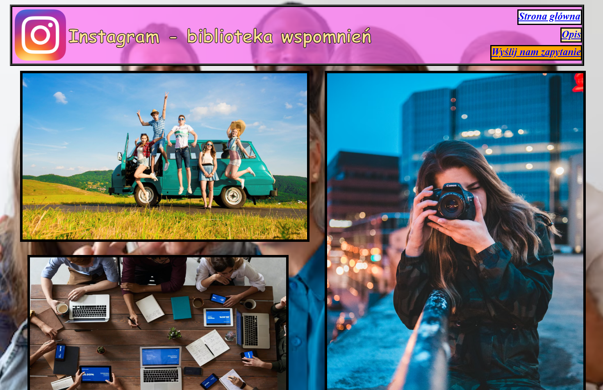
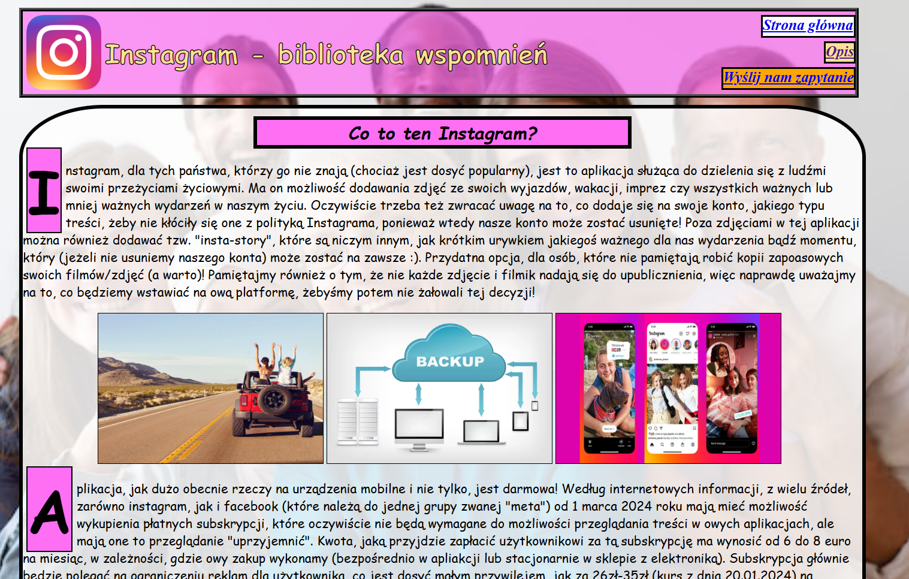
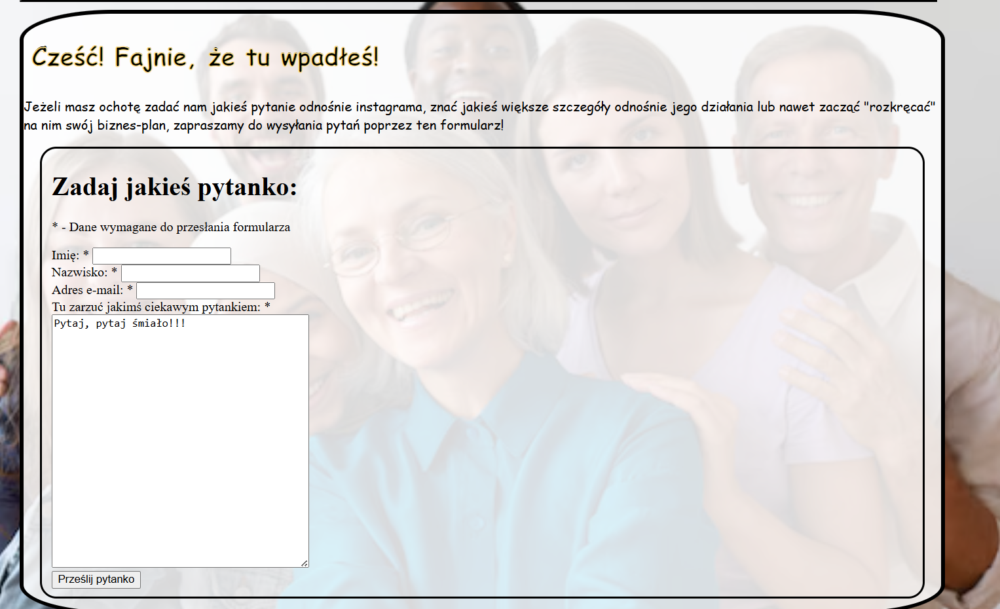

# PROSTA STRONA INTERNETOWA 🛜

To repozytorium zawiera moją pierwszą stronę internetową, która była realizowana na potrzeby prostego projektu na zajęcia oraz nauczenia się posługiwaniem połączenia języków HTML oraz CSS.
  Jest to prosta stronka opisująca popularną aplikację "Instagram" oraz zawierająca "formularz" z możliwością przesłania pytania.
  Nie jest to może nic wielkiego, ale od czegoś trzeba zacząć 😂😉

## Jak odpalić stronę?
Wystarczy pobrać folder z plikami z repozytorium i otworzyć plik "glowna", by móc przetestować stronę.

## Przykładowe zrzuty ekranu 📷

* Strona główna
 

* Strona opisu "produktu" (instagrama)
 

* Strona formularza z zapytaniem
 
